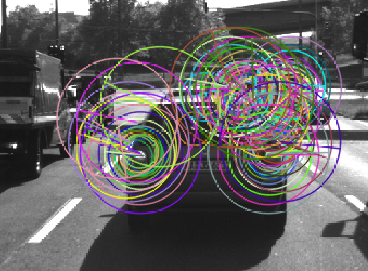

# SFND 2D Feature Tracking


The idea of the camera course is to build a collision detection system - that's the overall goal for the Final Project. As a preparation for this, you will now build the feature tracking part and test various detector / descriptor combinations to see which ones perform best. This mid-term project consists of four parts:

* First, you will focus on loading images, setting up data structures and putting everything into a ring buffer to optimize memory load.
* Then, you will integrate several keypoint detectors such as HARRIS, FAST, BRISK and SIFT and compare them with regard to number of keypoints and speed.
* In the next part, you will then focus on descriptor extraction and matching using brute force and also the FLANN approach we discussed in the previous lesson.
* In the last part, once the code framework is complete, you will test the various algorithms in different combinations and compare them with regard to some performance measures.

See the classroom instruction and code comments for more details on each of these parts. Once you are finished with this project, the keypoint matching part will be set up and you can proceed to the next lesson, where the focus is on integrating Lidar points and on object detection using deep-learning.

## Dependencies for Running Locally
* cmake >= 2.8
  * All OSes: [click here for installation instructions](https://cmake.org/install/)
* make >= 4.1 (Linux, Mac), 3.81 (Windows)
  * Linux: make is installed by default on most Linux distros
  * Mac: [install Xcode command line tools to get make](https://developer.apple.com/xcode/features/)
  * Windows: [Click here for installation instructions](http://gnuwin32.sourceforge.net/packages/make.htm)
* OpenCV >= 4.1
  * This must be compiled from source using the `-D OPENCV_ENABLE_NONFREE=ON` cmake flag for testing the SIFT and SURF detectors.
  * The OpenCV 4.1.0 source code can be found [here](https://github.com/opencv/opencv/tree/4.1.0)
* gcc/g++ >= 5.4
  * Linux: gcc / g++ is installed by default on most Linux distros
  * Mac: same deal as make - [install Xcode command line tools](https://developer.apple.com/xcode/features/)
  * Windows: recommend using [MinGW](http://www.mingw.org/)

## Basic Build Instructions

1. Clone this repo.
2. Make a build directory in the top level directory: `mkdir build && cd build`
3. Compile: `cmake .. && make`
4. Run it: `./2D_feature_tracking`.

*****

## Writeup

In the following sections will explain how all the [Rubric](https://review.udacity.com/#!/rubrics/2549/view) points have been solved.

### Task MP.0 - Mid-Term Report
You're reading it! ;-)

### Task MP.1 - Data Buffer Optimization
The data buffer has been optimized to just hold the last n data elements for processing. The number n can be configured by setting the variable *dataBufferSize* accordingly. You can find the implementation in MidTermProject_Camera_Student.cpp:

```c++
//// STUDENT ASSIGNMENT
//// TASK MP.1 -> replace the following code with ring buffer of size dataBufferSize

// push image into data frame buffer
DataFrame frame;
frame.cameraImg = imgGray;

// depending on if the maximum data buffer size is reached, remove the oldest image
if(dataBuffer.size() >= dataBufferSize)
    dataBuffer.erase(dataBuffer.begin());

dataBuffer.push_back(frame);

//// EOF STUDENT ASSIGNMENT
```

The std::vector is filled up until it's size reaches the configured threshold. From that, before adding any new elements, the first and oldest element is removed. This handling is called ring buffer.

### Task MP.2 - Keypoint Detection
The keypoint detection variants can be selected by setting the string variable *detectorType* to one of the following values:

* SHITOMASI - Shi-Tomasi "good features to track"
* HARRIS - Harris Corner Detector
* FAST - **F**eatures From **A**ccelerated **S**egment **T**est Detector
* BRISK - **B**inary **R**obust **I**nvariant **S**calable **K**eypoints Detector
* ORB - **O**riented FAST and **R**otated **B**RIEF Detector
* AKAZE
* SIFT - **S**cale **I**nvariant **F**eature **T**ransform Detector

In MidTermProject_Camera_Student.cpp, the selected variant leads to differen function calls that handle the detection:

```c++
//// STUDENT ASSIGNMENT
//// TASK MP.2 -> add the following keypoint detectors in file matching2D.cpp and enable string-based selection based on detectorType
//// -> HARRIS, FAST, BRISK, ORB, AKAZE, SIFT

if (detectorType.compare("SHITOMASI") == 0) {
    detKeypointsShiTomasi(keypoints, imgGray, false);
} else if (detectorType.compare("HARRIS") == 0) {
    detKeypointsHarris(keypoints, imgGray, false);
} else {
    detKeypointsModern(keypoints, imgGray, detectorType, false);
}
//// EOF STUDENT ASSIGNMENT
```

The implementation can be found in the matching2D_Student.cpp source file. Due to the nature of the implementation, the calls have been divided into the classic algorithms *detKeypointsShiTomasi* and *detKeypointsHarris*, and one common call for the rest - the modern - algorithms *detKeypointsModern*.

The Shi-Tomasi detects corners that are transformed to the OpenCV KeyPoint type and pushed to the resulting vector. The detector parameters have been reused from the lessons:

```c++
// Detect keypoints in image using the traditional Shi-Thomasi detector
void detKeypointsShiTomasi(vector<cv::KeyPoint> &keypoints, cv::Mat &img, bool bVis)
{
    // compute detector parameters based on image size
    int blockSize = 4;       //  size of an average block for computing a derivative covariation matrix over each pixel neighborhood
    double maxOverlap = 0.0; // max. permissible overlap between two features in %
    double minDistance = (1.0 - maxOverlap) * blockSize;
    int maxCorners = img.rows * img.cols / max(1.0, minDistance); // max. num. of keypoints

    double qualityLevel = 0.01; // minimal accepted quality of image corners
    double k = 0.04;

    // Apply corner detection
    double t = (double)cv::getTickCount();
    vector<cv::Point2f> corners;
    cv::goodFeaturesToTrack(img, corners, maxCorners, qualityLevel, minDistance, cv::Mat(), blockSize, false, k);

    // add corners to result vector
    for (auto it = corners.begin(); it != corners.end(); ++it)
    {

        cv::KeyPoint newKeyPoint;
        newKeyPoint.pt = cv::Point2f((*it).x, (*it).y);
        newKeyPoint.size = blockSize;
        keypoints.push_back(newKeyPoint);
    }
    t = ((double)cv::getTickCount() - t) / cv::getTickFrequency();
    cout << "Shi-Tomasi detection with n=" << keypoints.size() << " keypoints in " << 1000 * t / 1.0 << " ms" << endl;

    // visualize results
    VisualizeKeypoints(img, keypoints, "Shi-Tomasi Corner Detector Results", bVis);
}
```

The same is true for the Harris detector. Instead of taking the detected corners directly, a reduction through a non-maximum suppression in the local neighborhood of detected corners is used before transforming them to keypoints. The parameters again have been reused from the exercises in the lessons:

```c++
// Detect keypoints in image using the traditional Harris detector
void detKeypointsHarris(std::vector<cv::KeyPoint> &keypoints, cv::Mat &img, bool bVis)
{
    // Detector parameters
    int blockSize = 2; // for every pixel, a blockSize × blockSize neighborhood is considered
    int apertureSize = 3; // aperture parameter for Sobel operator (must be odd)
    int minResponse = 100; // minimum value for a corner in the 8bit scaled response matrix
    double k = 0.04; // Harris parameter (see equation for details)

    // Apply corner detection
    double t = (double)cv::getTickCount();

    cv::Mat dst, dst_norm; // result matrices for harris
    dst = cv::Mat::zeros(img.size(), CV_32FC1);

    // detect corners
    cv::cornerHarris(img, dst, blockSize, apertureSize, k, cv::BORDER_DEFAULT);

    // normalize values
    cv::normalize(dst, dst_norm, 0, 255, cv::NORM_MINMAX, CV_32FC1, cv::Mat());

    // extract keypoints using non-maximum suppression (NMS)
    double maxOverlap = 0.0;    // max overlap btw. features in %

    // loop over all pixels in the matrix
    for(size_t row = 0; row < dst_norm.rows; ++row) {
        for(size_t col = 0; col < dst_norm.cols; ++col) {

            int response = (int)dst_norm.at<float>(row, col);

            // only responses greater than minResponse will be taken into account
            if(response > minResponse) {
                // create KeyPoint
                cv::KeyPoint newKeyPoint;
                newKeyPoint.pt = cv::Point2f(col, row);
                newKeyPoint.size = 2 * apertureSize;
                newKeyPoint.response = response;

                // perform a non-maximum suppression in local neighborhood around key point
                bool bOverlap = false;

                for(auto it = keypoints.begin(); it != keypoints.end(); ++it) {

                    // get the overlap for the new keypoint
                    double kptOverlap = cv::KeyPoint::overlap(newKeyPoint, *it);

                    // check if overlap is above max
                    if(kptOverlap > maxOverlap) {
                        bOverlap = true;

                        // if overlap is over the maximum, take the keypoint with the
                        // best response
                        if(newKeyPoint.response > (*it).response) {
                            *it = newKeyPoint;
                            break;
                        }
                    }
                }

                // of the overlap flag is not set, add the new point
                if(bOverlap == false)
                    keypoints.push_back(newKeyPoint);
            }
        }
    }
    t = ((double)cv::getTickCount() - t) / cv::getTickFrequency();
    cout << "Harris detection with n=" << keypoints.size() << " keypoints in " << 1000 * t / 1.0 << " ms" << endl;

    // visualize results
    VisualizeKeypoints(img, keypoints, "Harris Corner Detector Results", bVis);
}
```

The rest of the supported detectors directly return keypoints instead of corners. Due to their similar nature of being used with the OpenCV library, they are combined in one common function call, making use of the cv::Ptr template to incarnate different detector types on one pointer variable:

```c++
// Detect keypoints in image using modern detectors FAST, BRISK, ORB, AKAZE or SIFT
void detKeypointsModern(std::vector<cv::KeyPoint> &keypoints, cv::Mat &img, std::string detectorType, bool bVis)
{
    // the feature detector pointer
    cv::Ptr<cv::FeatureDetector> detector = nullptr;
    std::string windowName = detectorType + " Keypoint Detector Results";

    if (detectorType.compare("FAST") == 0) {

        // Detector parameters
        int threshold = 30;     // difference between intensity of central px and px of a circle

        // create detector with NMS usage
        cv::FastFeatureDetector::DetectorType type = cv::FastFeatureDetector::TYPE_9_16;
        detector = cv::FastFeatureDetector::create(threshold, true, type);

    } else if (detectorType.compare("BRISK") == 0) {

        // create detector
        detector = cv::BRISK::create();

    } else if (detectorType.compare("ORB") == 0) {

        // create detector
        detector = cv::ORB::create();

    } else if (detectorType.compare("AKAZE") == 0) {

        // create detector
        detector = cv::AKAZE::create();

    } else if (detectorType.compare("SIFT") == 0) {

        // create detector
        detector = cv::xfeatures2d::SIFT::create();

    } else {
        cout << "Error: Unknown detector type " << detectorType << " configured" << endl;
        return;
    }

    // detect keypoints
    double t = (double)cv::getTickCount();
    detector->detect(img, keypoints);
    t = ((double)cv::getTickCount() - t) / cv::getTickFrequency();
    cout << detectorType << " detection with n=" << keypoints.size() << " keypoints in " << 1000 * t / 1.0 << " ms" << endl;

    // visualize results
    VisualizeKeypoints(img, keypoints, windowName, bVis);
}
```

### Task MP.3 - Keypoint Removal
In real life systems, all keypoints are valuable and important to ensure nothing is overseen by collision avoidance systems in cars. To enable a more targeted evaluation of the different detector/descriptor combinations though, concentration is focused on the vehicle directly in front, so all keypoints outside of a specific region of interest (ROI) are discarded, making use of the *cv::Rectangle* type with it's *contains* member function. You can find the implementation in MidTermProject_Camera_Student.cpp:

```c++
//// TASK MP.3 -> only keep keypoints on the preceding vehicle

// only keep keypoints on the preceding vehicle
bool bFocusOnVehicle = true;
cv::Rect vehicleRect(535, 180, 180, 150);
if (bFocusOnVehicle) {

    auto it = keypoints.begin();

    // loop over all keypoints
    while(it != keypoints.end()) {

        // check if the keypoint lies in the vehicleRect and remove if not
        if(vehicleRect.contains(it->pt))
            ++it;
        else
            it = keypoints.erase(it);
    }

    cout << "Number of keypoints after ROI adaption: " << keypoints.size() << endl;

    // show reduced keypoints
    VisualizeKeypoints(imgGray, keypoints, "ROI Reduced Keypoints Result");
}

//// EOF STUDENT ASSIGNMENT
```

### Task MP.4 - Keypoint Descriptors
For keypoint description, like for keypoint detection, multiple algorithms have been implemented, selectable by setting sepcific strings in MidTermProject_Camera_Student.cpp:

* BRISK - **B**inary **R**obust **I**nvariant **S**calable **K**eypoints Descriptor
* BRIEF - **B**inary **R**obust **I**ndependent **E**lementary **F**eatures
* ORB - **O**riented FAST and **R**otated **B**RIEF Descriptor
* FREAK - **F**ast **Re**tin**a** **K**eypoints Descriptor
* AKAZE
* SIFT - **S**cale **I**nvariant **F**eature **T**ransform Descriptor

```c++
//// STUDENT ASSIGNMENT
//// TASK MP.4 -> add the following descriptors in file matching2D.cpp and enable string-based selection based on descriptorType
//// -> BRIEF, ORB, FREAK, AKAZE, SIFT

cv::Mat descriptors;
string descriptorType = "BRISK"; // BRISK, BRIEF, ORB, FREAK, AKAZE, SIFT
descKeypoints((dataBuffer.end() - 1)->keypoints, (dataBuffer.end() - 1)->cameraImg, descriptors, descriptorType);
//// EOF STUDENT ASSIGNMENT
```

Like with the modern detectors, the descriptors are handled in one common function in  the matching2D_Student.cpp file. It again uses the cv::Ptr template pointer type. All parameters have been reused from the lesson's exercises:

```c++
// Use one of several types of state-of-art descriptors to uniquely identify keypoints
void descKeypoints(vector<cv::KeyPoint> &keypoints, cv::Mat &img, cv::Mat &descriptors, string descriptorType)
{
    // select appropriate descriptor
    cv::Ptr<cv::DescriptorExtractor> extractor;
    if (descriptorType.compare("BRISK") == 0) {

        int threshold = 30;        // FAST/AGAST detection threshold score.
        int octaves = 3;           // detection octaves (use 0 to do single scale)
        float patternScale = 1.0f; // apply this scale to the pattern used for sampling the neighbourhood of a keypoint.

        extractor = cv::BRISK::create(threshold, octaves, patternScale);

    } else if (descriptorType.compare("BRIEF") == 0) {
        extractor = cv::xfeatures2d::BriefDescriptorExtractor::create();
    } else if (descriptorType.compare("ORB") == 0) {
        extractor = cv::ORB::create();
    } else if (descriptorType.compare("FREAK") == 0) {
        extractor = cv::xfeatures2d::FREAK::create();
    } else if (descriptorType.compare("AKAZE") == 0) {
        extractor = cv::AKAZE::create();
    } else if (descriptorType.compare("SIFT") == 0) {
        extractor = cv::xfeatures2d::SIFT::create();
    } else {
        cout << "Unknown descriptor type " << descriptorType << endl;
        return;
    }

    // perform feature description
    double t = (double)cv::getTickCount();
    extractor->compute(img, keypoints, descriptors);
    t = ((double)cv::getTickCount() - t) / cv::getTickFrequency();
    cout << descriptorType << " descriptor extraction in " << 1000 * t / 1.0 << " ms" << endl;
}
```

### Task MP.5/6 - Descriptor Matching/Descriptor Distance Ratio
The tasks 5 and 6 are solved in the *matchDescriptors* function, called from the MidTermProject_Camera_Student.cpp source file:

```c++
//// STUDENT ASSIGNMENT
//// TASK MP.5 -> add FLANN matching in file matching2D.cpp
//// TASK MP.6 -> add KNN match selection and perform descriptor distance ratio filtering with t=0.8 in file matching2D.cpp

matchDescriptors((dataBuffer.end() - 2)->keypoints, (dataBuffer.end() - 1)->keypoints,
                 (dataBuffer.end() - 2)->descriptors, (dataBuffer.end() - 1)->descriptors,
                 matches, descriptorType, matcherType, selectorType);

//// EOF STUDENT ASSIGNMENT
```

The operation is implemented in matching2D_Student.cpp. The matcher to use can be selected with the matcherType string:

* MAT_BF - Brute Force Matcher
* MAT_FLANN - **F**ast **L**ibrary for **A**pproximate **N**earest **N**eighbors

For the FLANN matcher type, the current OpenCV version may have problems if the descriptor source is not of type CV_32F, so a workaround has been implemented by converting the values - slowing down the processing a little. Also, the template pointer cv::Ptr has been used again:

```c++
// configure matcher
bool crossCheck = false;
cv::Ptr<cv::DescriptorMatcher> matcher;

if (matcherType.compare("MAT_BF") == 0) {
    int normType = cv::NORM_HAMMING;
    matcher = cv::BFMatcher::create(normType, crossCheck);
} else if (matcherType.compare("MAT_FLANN") == 0) {

    if(descSource.type() != CV_32F) {
        descSource.convertTo(descSource, CV_32F);
        descRef.convertTo(descRef, CV_32F);
    }

    matcher = cv::DescriptorMatcher::create(cv::DescriptorMatcher::FLANNBASED);
} else {
    cout << "Unknown matcher type " << matcherType << endl;
    return;
}
```

Besides the matcher type, the selector type can be selected as well by setting the selectorType variable to one of the following values:

* SEL_NN - Nearest Neighbor
* SEL_KNN - k Nearest Neighbors

Depending on the activated selector, either only the nearest neighbor is returned, or the k nearest neighbors are retrieved, followed by filtering with a minimum descriptor distance ratio of 0.8:

```c++
// perform matching task
if (selectorType.compare("SEL_NN") == 0) {
    // nearest neighbor (best match)

    matcher->match(descSource, descRef, matches); // Finds the best match for each descriptor in desc1
} else if (selectorType.compare("SEL_KNN") == 0) {
    // k nearest neighbors (k=2)
    vector<vector<cv::DMatch>> knnMatches;
    matcher->knnMatch(descSource, descRef, knnMatches, 2);

    // filter min descriptor distance ratio
    double minDescDistRatio = 0.8;
    for(auto it = knnMatches.begin(); it != knnMatches.end(); ++it) {
        if((*it)[0].distance < (minDescDistRatio * (*it)[1].distance))
            matches.push_back((*it)[0]);
    }

} else {
    cout << "Unknown selector type " << selectorType << endl;
    return;
}
```

### Task MP.7 - Performance Evaluation 1

The following table shows the number of keypoints for all of the 10 images depending on the selected keypoint detector - after the ROI adaption to the preceding car:

| Detector | Image 0 | Image 1 | Image 2 | Image 3 | Image 4 | Image 5 | Image 6 | Image 7 | Image 8 | Image 9 | Sum | Avg |
| :--- | :--- |:--- |:--- |:--- |:--- |:--- |:--- |:--- |:--- |:--- |:--- |:--- |
| **SHITOMASI** |125|118|123|120|120|113|114|123|111|112|**1,179**|**118**|
| **HARRIS** |17|14|18|21|26|43|18|31|26|24|**238**|**24**|
| **FAST** |149|152|150|155|149|149|156|150|138|143|**1,491**|**149**|
| **BRISK** |264|282|282|277|297|279|289|272|266|254|**2,762**|**276**|
| **ORB** |92|102|106|113|109|125|130|129|127|128|**1,161**|**161**|
| **AKAZE** |166|157|161|155|163|164|173|175|177|179|**1,670**|**167**|
| **SIFT** |138|132|124|137|134|140|137|148|159|137|**1,386**|**139**|

Notes according to the size, neighborhood and distribution of the keypoints:

#### SHITOMASI


* small in size (fixed keypoint size)
* evenly distributed at car's backside
* found keypoints at taillights, license plate and in the window where the headrests can be seen, not many at the car's back's bottom edge

#### HARRIS


* small in size (fixed keypoint size)
* not as evenly distributed as in Shi-Tomasi
* not as constant from frame to frame as in Shi-Tomasi
* less points than in Shi-Tomasi
* mainly located at taillights, middle breaking light, antenna
* not so much clustered regarding it's neighbors
* some outliers of the car at the edge of the ROI (cars in front of the target)

#### FAST

* bigger in size than the above two
* many keypoints found
* mainly located at the edges of the car, along the sides and the roof
* some keypoints also spread at the back of the preceding car
* outliers/false positives on the ground (lane markings) and other cars in front
* clustered along with other keypoints

#### BRISK


* different in size and orientation depending on the detection
* many keypoints found, much more than the above mentioned detectors
* mainly located at the edges of the car, along the sides and the roof
* some keypoints also spread at the back of the preceding car
* the keypoints are clustered together very much

#### ORB


* different in size and orientation depending on the detection
* many keypoints found, comparable to Shi-Tomasi
* keypoints clustered at taillights and contour of the preceding car
* outliers/false positives at other cars in front

#### AKAZE


* different in size and orientation depending on the detection, smaller than FAST
* many keypoints found, comparable to FAST
* keypoints clustered at taillights and contour of the preceding car
* outliers/false positives at other cars in front

#### SIFT


* very different in size
* mainly clustered at the car's contour edges, taillights and license plate
* many false positive, below the car but mainly at other cars in front of the preceding car

### Task MP.8 - Performance Evaluation 2

The following table shows the sum of matched keypoints in the 10 images on matching for all detector descriptor combinations. For the matching, a brute force approach has been taken (MAT_BF) with the k-nearest neighbor and a minimum descriptor distance ratio of 0.8:

|Detector/Descriptor|BRISK|BRIEF|ORB|FREAK|AKAZE|SIFT|
|:-|:-|:-|:-|:-|:-|:-|
|**SHITOMASI**|767|944|907|768|n/a|n/a -- TODO|
|**HARRIS** -- TODO check why different|142|173|160|144|n/a|n/a -- TODO|
|**FAST**|899|1,099|1,081|878|n/a|n/a -- TODO|
|**BRISK**|1,570|1,704|1,510|1,524|n/a|n/a -- TODO|
|**ORB**|751|545|761|420|n/a|n/a -- TODO|
|**AKAZE**|1,215|1,266|1,186|1,187|1,259|n/a -- TODO|
|**SIFT**|592|702|OutOfMemoryError|593|n/a|n/a -- TODO|

### Task MP.9 - Performance Evaluation 3

In the table below the average time in milliseconds for keypoints detection and matching is listed for each detector and descriptor combination. Both times have been summed up and averaged:

|Detector/Descriptor|BRISK|BRIEF|ORB|FREAK|AKAZE|SIFT|
|:-|:-|:-|:-|:-|:-|:-|
|**SHITOMASI**|14.512|14.154|16.336|35.482|n/a|n/a -- TODO|
|**HARRIS** -- TODO check why different|15.661|15.345|17.569|36.603|n/a|n/a -- TODO|
|**FAST**|2.51|1.61|3.705|26.72|n/a|n/a -- TODO|
|**BRISK**|37.9|35.075|44.201|59.918|n/a|n/a -- TODO|
|**ORB**|7.273|11.045|15.819|31.78|n/a|n/a -- TODO|
|**AKAZE**|59.506|55.579|63.317|77.554|100.67|n/a -- TODO|
|**SIFT**|99.579|102.269|OutOfMemoryError|126.687|n/a|n/a -- TODO|
